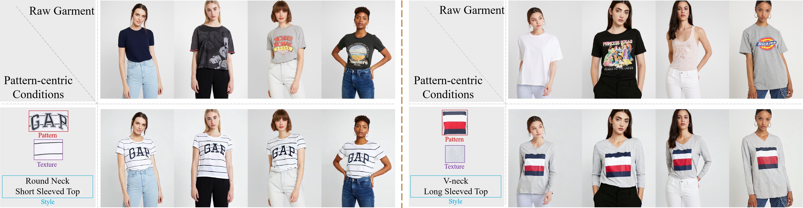

# PatternDiff: A New Benchmark for Tailored Garment Design with a Pattern-centric Multimodal Diffusion Model
&nbsp;
## Environments
```bash
conda env create -f environment.yml
```
## Inference
You can download the model weight from this Link.
```bash
python demo.py --input_ckpt <model weight path>
```
## PatternFasion Dataset
First, it is required to download three datasets: [DressCode](https://github.com/aimagelab/dress-code), [VITON-HD](https://github.com/shadow2496/VITON-HD) and [StreetTryOn](https://github.com/cuiaiyu/street-tryon-benchmark). Note that only the upper body category data from the DressCode dataset is needed, and the file shall be renamed as dresscode. All other annotation data should be downloaded from this link. The data format of the dataset is shown below.
```
PatternFasion/
   --dresscode/
      --pattern/
      --texture/
      --dresscode.json
      --test_dresscode.text
      --train_dresscode.text
   --vitonhd/
      --pattern/
      --texture/
      --vitonhd.json
      --test_vitonhd.text
      --train_vitonhd.text
   --streettryon/
      --pattern/
      --texture/
      --streettryon.json
      --test_streettryon.text
      --train_streettryon.text
```
## Train
The pretrained mode can be downloaded from this [Link](https://huggingface.co/booksforcharlie/stable-diffusion-inpainting). And The controlnet mode can be downloaded the this [Link](https://huggingface.co/lllyasviel/control_v11p_sd15_openpose)
```bash
accelerate launch --multi_gpu --mixed_precision "fp16" train.py
--pretrained_model_name_or_path= <stable diffusion inpainting model path>
--image_encoder_path= <image encoder path>
--train_batch_size= <batch size>
--output_dir= <save weight directory>
--save_steps= 
--controlnet_model_path= <controlnet model path>
--data_root_path= <PatternFasion Dataset path>

```
